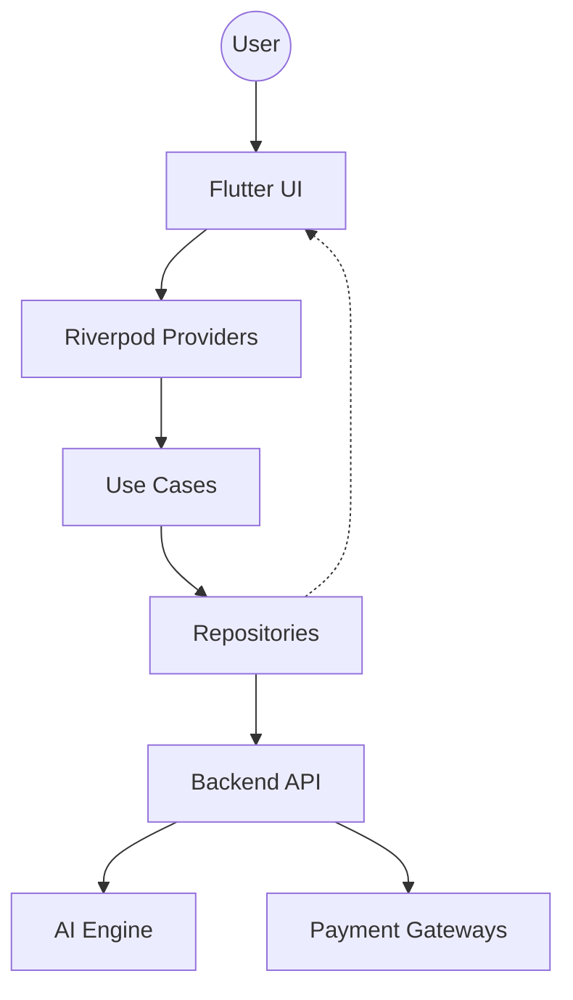
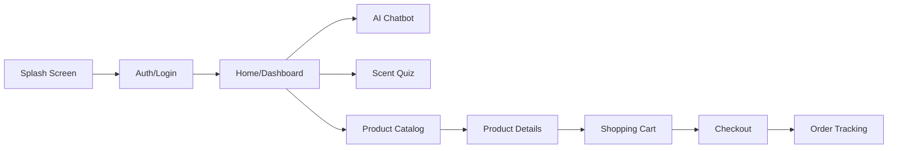

# Design Document: PerfumeGPT Customer Mobile App

## 1. Overview
PerfumeGPT is an AI-powered perfume consultation and retail management system. This document specifically covers the design of the **Customer Mobile App**, a Flutter-based application designed to provide users with a personalized fragrance shopping experience through AI-driven chat, interactive quizzes, and a complete e-commerce journey.

The app is part of a monorepo managed by Melos, allowing for shared logic across the Customer and Staff applications.

## 2. Detailed Analysis
### 2.1 Problem Statement
Traditional perfume retail lacks personalization. Customers struggle to find scents that match their unique preferences, leading to decision fatigue. Online shopping further distances the customer from the sensory experience of testing perfumes.

### 2.2 Goals
- **Personalization:** Use AI to simulate a human fragrance expert.
- **Engagement:** Interactive quizzes and AI chat to guide the user.
- **Convenience:** Full e-commerce suite (browsing, ordering, tracking) with local Vietnamese integrations (VNPay, Momo, GHN, GHTK).
- **Scalability:** Built within a monorepo to share core logic and UI components.

### 2.3 Target Audience
- Fragrance enthusiasts looking for new discoveries.
- Gift shoppers needing expert advice.
- Regular customers of the PerfumeGPT retail ecosystem.

## 3. Alternatives Considered
### 3.1 Architecture: Monolithic vs. Monorepo
- **Monolithic:** Easier to start, but difficult to share code between Customer and Staff apps.
- **Monorepo (Chosen):** Using Melos to manage `apps/customer_app`, `apps/staff_app`, and shared `packages/`. This promotes code reuse and consistency.

### 3.2 State Management: BLoC vs. Riverpod vs. ChangeNotifier
- **ChangeNotifier:** Built-in but can become messy for complex apps.
- **BLoC:** Excellent for strict event-driven logic but high boilerplate.
- **Riverpod (Chosen):** Modern, compile-safe, and handles asynchronous state (AI responses) elegantly with `AsyncValue`.

## 4. Detailed Design

### 4.1 Architecture (Clean Architecture)
The app follows Clean Architecture principles to ensure maintainability and testability:
- **Presentation Layer:** Flutter Widgets and Riverpod Providers.
- **Domain Layer:** Pure Dart entities and use cases (Business Logic).
- **Data Layer:** Repository implementations, API clients (Dio), and Data Transfer Objects (DTOs).

### 4.2 Module Breakdown
1. **Auth Module:** SSO (Google/Facebook) and traditional login.
2. **AI Consultation Module:**
   - **Chatbot:** Natural language interface using OpenAI (via backend).
   - **Quiz:** 5-question interactive flow.
3. **Store Module:** Product catalog, semantic search, and reviews.
4. **Order Module:** Cart, Checkout (VNPay/Momo), and Tracking (GHN/GHTK).
5. **Profile Module:** Scent preferences, history, and loyalty points.

### 4.3 Key Integrations
- **Payment:** VNPay (WebView/Bank redirect) and Momo (App-to-App).
- **Shipping:** GHN/GHTK via backend API synchronization.
- **AI:** OpenAI GPT models integrated via the PerfumeGPT Backend API.

### 4.4 Data Flow Diagram

### 4.5 Navigation Flow

## 5. Summary
The PerfumeGPT Customer App leverages Flutter and AI to revolutionize the fragrance shopping experience. By employing a monorepo structure with Clean Architecture and Riverpod, the app ensures high performance, maintainability, and a premium user experience tailored to the Vietnamese market.

## 6. References
- [Flutter Clean Architecture Best Practices](https://blog.cleancoder.com/uncle-bob/2012/08/13/the-clean-architecture.html)
- [Riverpod Documentation](https://riverpod.dev)
- [Melos Monorepo Management](https://melos.invertase.dev)
- [VNPay & Momo Integration Guides 2024]
- [GHN & GHTK API Documentation]
