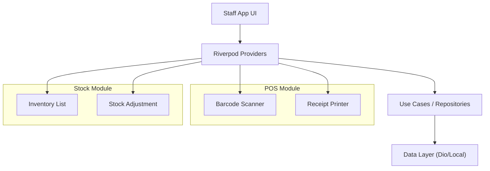

# PerfumeGPT Staff App Design Document

## Overview
The **PerfumeGPT Staff App** is a specialized mobile application designed to empower retail staff in the PerfumeGPT ecosystem. It provides essential tools for in-store operations, including a Mobile POS system and real-time inventory management.

## Detailed Analysis
Traditional perfume retail often suffers from disconnected systems between in-store sales and backend inventory. The Staff App bridges this gap by providing:
- **Mobility:** Staff can assist customers and manage stock anywhere in the store.
- **Efficiency:** Quick barcode scanning for sales and stock checks reduces manual entry errors.
- **Accuracy:** Real-time stock adjustments ensure the system always reflects physical inventory.

### Goals
- Provide a generic, extensible Mobile POS interface.
- Implement comprehensive stock checking and adjustment capabilities.
- Maintain visual and architectural consistency with the existing Customer App.

## Alternatives Considered
- **Web-based Staff Portal:** While easier to develop, it lacks the mobility and native hardware integration (barcode scanning, thermal printing) required for an active retail environment.
- **All-in-one App:** Combining customer and staff features into a single app would lead to a bloated codebase and complex permission management. A dedicated staff app is more secure and focused.

## Detailed Design

### Architecture
The app follows **Clean Architecture** principles, mirroring the `customer_app` to ensure maintainability and code sharing where possible.

- **Presentation Layer:** Flutter Widgets managed by **Riverpod** for reactive state handling.
- **Domain Layer:** Pure Dart entities and abstract repository definitions.
- **Data Layer:** Repository implementations, DTOs (Data Transfer Objects), and local/remote data sources.

### Tech Stack
- **Framework:** Flutter (iOS/Android)
- **State Management:** Riverpod (with code generation)
- **Navigation:** GoRouter
- **Networking:** Dio
- **Data Modeling:** Freezed & JSON Serializable
- **Barcode Scanning:** `mobile_scanner` (Placeholder)
- **Receipt Printing:** `flutter_thermal_printer` & `esc_pos_utils_plus` (Placeholder)

### Data Models
- `Product`: Shared with the customer app, including SKU, stock levels, and pricing.
- `Transaction`: Represents a POS sale.
- `StockAdjustment`: Records changes in inventory levels.

### Key Features Design

#### 1. Mobile POS (Generic)
- **Checkout Flow:** Scan Barcode -> Add to Cart -> Select Payment Method -> Process Payment -> Print Receipt.
- **Implementation:** Use a modular approach for scanning and printing to allow for future hardware-specific integrations.

#### 2. Stock Checking & Adjustment
- **Search/Filter:** Search by name, SKU, or category.
- **Details:** View current stock, expiry dates, and location.
- **Adjustment:** Form to update stock levels with reason codes (e.g., damage, return, restock).
- **Stock-In:** Dedicated flow for receiving new shipments.

### Visual Design
- **Branding:** Consistent with `customer_app`.
- **Primary Color:** `Colors.deepPurple` (Seed)
- **Typography:** `GoogleFonts.openSans`
- **Theme:** Support for both Light and Dark modes.

## Diagrams

## Summary
The PerfumeGPT Staff App will be a robust, Flutter-based mobile solution that streamlines in-store operations. By leveraging the same architectural patterns as the Customer App, we ensure a unified development experience and a reliable system for retail staff.

## References
- [Flutter POS Packages 2024/2025 Research](https://pub.dev/packages?q=pos)
- [Riverpod Documentation](https://riverpod.dev)
- [Clean Architecture in Flutter](https://blog.cleancoder.com/uncle-bob/2012/08/13/the-clean-architecture.html)
